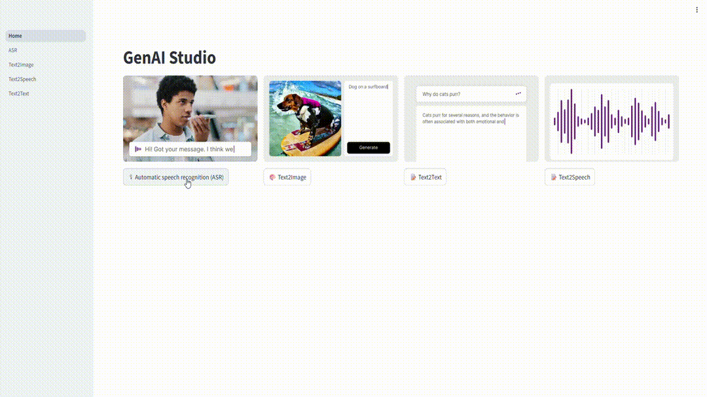

# GenAI Studio

## Index
- [Introduction](#introduction)
- [Demo](#demo)
- [Setup GenAI-studio](#setup-genai-studio)
- [Generate Models](#generate-models)
- [Run Applications](#run-applications)

## Introduction
GenAI Studio is a containarized solution to simplifies the creation and deployment of Generative AI applications on Qualcomm Linux systems. Currently genai-studio has applications for Text Generation, Text-to-Speech, Image Generation, and Speech-to-Text. All applications are accessible through a simple web interface. GenAI Studio enables rapid prototyping and customization of AI workflows. 

1. We do not distribute any model files, container images with genai-studio yet
2. Users need to follow the steps given to generate the models, build container images. Host machine requirements are documented at AI hub portal : https://github.com/quic/ai-hub-apps/tree/main/tutorials/llm_on_genie
3. Users can use target machine (e.g. IQ9) to build docker containres when using Qualcomm Ubuntu. In case of Qualcomm Linux, docker containres are to be built on host machine itself. 

| Use Case  | Description | Supported Platfroms |
| :---        |   -------------  | -------------     |
| Text-to-Text  | Generates human-like response with LLM, for input prompt.Useful for creating articles, summaries, reports, or creative content automatically  | IQ9 Qualcomm Linux <br>IQ9 Qualcomm Ubuntu |
| Text-to-Speech  | Transforms text into clear, natural-sounding audio. Ideal for applications such as voice assistants, audiobooks, and accessibility solutions  | IQ9 Qualcomm Linux <br>IQ9 Qualcomm Ubuntu |
| Text-to-Image  | Generates images from text descriptions. Ideal for creating graphics, illustrations, or visual content without manual design  | IQ9 Qualcomm Linux <br>IQ9 Qualcomm Ubuntu |
| Speech-to-Text  | Turns spoken words into written text. Helpful for transcription, voice commands, and hands-free applications  | IQ9 Qualcomm Linux <br>IQ9 Qualcomm Ubuntu |
| Web-UI  | Provides an easy-to-use web interface to access all these features in one place, making it simple for developers and users | IQ9 Qualcomm Linux <br>IQ9 Qualcomm Ubuntu |

<br><br>

## Demo


<br><br>

## Setup GenAI studio
### Target Platform
  - [Qualcomm Ubuntu](#ubuntu)
  - [Qualcomm Linux](#qli)

### Ubuntu
#### Flash Target Image
  For Qualcomm IQ9
             
  > Follow [Flash the software images to the Dragonwing IQ-9075 EVK](https://docs.qualcomm.com/bundle/resource/topics/80-90441-252/Integrate-and-flash-software.html?product=1601111740076074&facet=Ubuntu%20quickstart) to download and flash Ubuntu image
#### Install Qualcomm dependent packages
> Add Qualcomm IoT PPA repository, which provides the necessary packages and updates
```
sudo add-apt-repository ppa:ubuntu-qcom-iot/qcom-ppa
```
```
sudo apt update
```

> Install required Qualcomm libraries and tools to access Qualcomm hardware
```
sudo apt install -y qcom-fastrpc1 qcom-libdmabufheap-dev qcom-fastrpc-dev qcom-dspservices-headers-dev libqnn1 qnn-tools libsnpe1 snpe-tools qcom-property-vault gstreamer1.0-plugins-qcom-mlmetaparser gstreamer1.0-plugins-qcom-mlvpose
```

Learn more about [QNN](https://docs.qualcomm.com/bundle/publicresource/topics/80-63442-10/index_QNN.html) and [SNPE](https://docs.qualcomm.com/bundle/publicresource/topics/80-63442-10/index_SNPE.html)
#### CDI setup
> CDI stands for Container Device Interface. provides a interface that allows containers to access Qualcomm DSP or GPU resources 
```
curl -L -O https://git.codelinaro.org/clo/le/sdk-tools/-/raw/imsdk-tools.lnx.1.0.r1-rel/qimsdk-ubuntu/generate_cdi_json.sh?ref_type=heads&inline=false
```
> Install CDI dependencies
```
bash generate_cdi_json.sh
```
> Verify CDI file
```
ls /etc/cdi/docker-run-cdi-hw-acc.json
```
#### Replace "/etc/cdi/docker-run-cdi-hw-acc.json" with [docker-run-cdi-hw-acc.json](docker-run-cdi-hw-acc.json) from this folder

> Modify permissions of /opt/ folder to access artifacts
```
sudo chown -R ubuntu:ubuntu /opt/
```

#### Validate Qualcomm NPU
```
snpe-platform-validator --runtime dsp
```
#### Expected output

> "DSP Passed" from above log ensures DSP runtime is supported on device

#### Docker Installation
##### Follow below steps to install Docker and dependencies

> Update package index
```
sudo apt-get update
 ```
> Install required packages
```
sudo apt-get install -y ca-certificates curl gnupg lsb-release
 ```
> Add Docker’s official GPG key
```
sudo mkdir -p /etc/apt/keyrings
curl -fsSL https://download.docker.com/linux/ubuntu/gpg | \
    sudo gpg --dearmor -o /etc/apt/keyrings/docker.gpg
 ```
> Set up the Docker repository
```
echo \
  "deb [arch=$(dpkg --print-architecture) signed-by=/etc/apt/keyrings/docker.gpg] \
  https://download.docker.com/linux/ubuntu $(lsb_release -cs) stable" | \
  sudo tee /etc/apt/sources.list.d/docker.list > /dev/null
 ```
> Update package index 
```
sudo apt-get update
 ```

> Install Docker Engine
```
sudo apt-get install -y docker-ce docker-ce-cli containerd.io  docker-compose
```

> Add your user to the docker group (to run docker without sudo)
```
sudo usermod -aG docker $USER
```
```
newgrp docker
```

> Create /etc/docker directory for docker daemon configuration
```
mkdir -p /etc/docker/
```
> Add/Update content in /etc/docker/daemon.json to add CDI support
``` 
{
   "features": {
      "cdi": true
   }
}
```
> Restart docker service for CDI support
```
sudo systemctl restart docker
```

#### Build usecase container images
```
git clone https://github.com/quic/sample-apps-for-qualcomm-linux.git
```
```
cd sample-apps-for-qualcomm-linux/GenAI-Solutions/GenAI-Studio
```
##### NOTE: Generating container image depends on network connection and can take more than 30 minutes each
> Speech-To-Text
```
cd Speech-To-Text
docker  build --progress=plain -t asr .
docker save -o asr asr
cd ..
```
> Text-Generation
```
cd Text-Generation
docker  build --progress=plain -t text2text . 
docker save text2text -o text2text
cd ..
```
> Text-To-Speech
```
cd Text-To-Speech
docker  build --progress=plain -t text2speech . 
docker save text2speech -o text2speech
cd ..
```
> Image-Generation

```
cd Image-Generation
docker  build --progress=plain -t text2image . 
docker save text2image -o text2image
cd ..
```
> web-ui
```
cd web-ui
docker  build --progress=plain -t web-ui . 
docker save web-ui -o web-ui
cd ..
```

#### Load containers
```
docker load -i Speech-To-Text/asr
docker load -i Text-Generation/text2text
docker load -i Text-To-Speech/text2speech
docker load -i Image-Generation/text2image
docker load -i web-ui/web-ui
```
Follow [Generate Models](#generate-models) for next steps
### QLI
  For Qualcomm IQ9
  > Download Pre-compiled  [QLI Image](https://artifacts.codelinaro.org/artifactory/qli-ci/flashable-binaries/qimpsdk/qcs9075-iq-9075-evk/x86-qcom-6.6.90-QLI.1.5-Ver.1.1_qim-product-sdk-image-2.0.1.zip) and Follow [Build Guide - Qualcomm® Linux Documentation](https://docs.qualcomm.com/bundle/publicresource/topics/80-70020-254/flash_images.html?vproduct=1601111740013072&version=1.5) document to flash QLI image
##### NOTE: On QLI, Qualcomm dependent DSP libraries and Docker are pre-installed

#### On Host x86 machine
##### Stepup arm64 qemu Docker driver on x86 machine
> Provides QEMU emulation binaries that allow running containers built for different CPU architectures (ARM64) on a host with another architecture (x86_64).
```
docker run --rm --privileged multiarch/qemu-user-static --reset -p yes
docker buildx rm builder
docker buildx create --name builder --driver docker-container --use
docker buildx inspect --bootstrap
```
##### Build usecase container images
```
git clone https://github.com/quic/sample-apps-for-qualcomm-linux.git
```
```
cd sample-apps-for-qualcomm-linux/GenAI-Solutions/GenAI-Studio
```
##### NOTE: Generating container image depends on network connection and can take more than 30 minutes each
> Speech-To-Text
```
cd Speech-To-Text
docker  build --progress=plain --platform=linux/arm64/v8 -t asr .
docker save -o asr asr
cd ..
```
> Text-Generation
```
cd Text-Generation
docker  build --progress=plain --platform=linux/arm64/v8  -t text2text .
docker save text2text -o text2text
cd ..
```
> Text-To-Speech
```
cd Text-To-Speech
docker  build --progress=plain --platform=linux/arm64/v8  -t text2speech .
docker save text2speech -o text2speech
cd ..
```
> Image-Generation

```
cd Image-Generation
docker  build --progress=plain --platform=linux/arm64/v8  -t text2image .
docker save text2image -o text2image
cd ..
```
> web-ui
```
cd web-ui
docker  build --progress=plain --platform=linux/arm64/v8  -t web-ui .
docker save web-ui -o web-ui
cd ..
```

##### Push containers onto the target device

Follow [Setup](https://docs.qualcomm.com/bundle/publicresource/topics/80-70020-254/how_to.html?vproduct=1601111740013072&version=1.5#setup) to get IP address using UART/ADB

```
scp -r Speech-To-Text/asr Text-Generation/text2text Text-To-Speech/text2speech Image-Generation/text2image  web-ui/web-ui ubuntu@<target-ip-address>:/opt/
```

#### On Target device
##### Load containers
```
docker load -i Speech-To-Text/asr
docker load -i Text-Generation/text2text
docker load -i Text-To-Speech/text2speech
docker load -i Image-Generation/text2image
docker load -i web-ui/web-ui
```
Follow [Generate Models](#generate-models) for next steps

## Generate Models
### On Host machine (Linux X86)

#### Text Generation
> Environment Setup

Follow https://github.com/quic/ai-hub-apps/tree/main/tutorials/llm_on_genie

> Export model
```
python -m qai_hub_models.models.llama_v3_8b_instruct.export --chipset qualcomm-snapdragon-x-elite --skip-inferencing --skip-profiling --output-dir genie_bundle
```
##### NOTE: The export command may take 2–3 hours and requires significant memory (RAM + swap) on the host.
> Push models folder genie_bundle to "/opt/" on target device

Follow [Setup](https://docs.qualcomm.com/bundle/publicresource/topics/80-70020-254/how_to.html?vproduct=1601111740013072&version=1.5#setup) to get IP address using UART/ADB
```
scp -r genie_bundle ubuntu@<target-ip-address>:/opt/
```
#### Text To Speech
Install  https://qpm.qualcomm.com/#/main/tools/details/VoiceAI_TTS and follow "VoiceAI_TTS/1.0.1.0/notebook/melo/npu/README.md" to generate models
> Push models to "/opt/TTS_models/" on target device
```
scp -r TTS_models ubuntu@<target-ip-address>:/opt/
```

Follow [Run applications](#run-applications) for next steps

## Run applications 
### On Target Device
```
git clone https://github.com/quic/sample-apps-for-qualcomm-linux.git
```
```
cd sample-apps-for-qualcomm-linux/GenAI-Solutions/GenAI-Studio
```
#### Start  GenAI Studio
```
docker-compose -f docker-compose.yml up -d
```
> Expected output


**NOTE:** If you face error "CDI device injection failed: failed to inject devices: failed to stat CDI host device "/dev/kgsl-3d0": no such file or directory"

**Solution**: Remove "/dev/kgsl-3d0" from /etc/cdi/docker-run-cdi-hw-acc.json
```
{
   "path": "/dev/kgsl-3d0"
},
```

If there are any other errors use "**[docker-run-cdi-hw-acc.json](docker-run-cdi-hw-acc.json)**" 

> Network URL
```
docker logs -f web-ui
```
> Expected output
```
  You can now view your Streamlit app in your browser.

  Local URL: http://localhost:8501

  Network URL: http://192.168.0.4:8501
```
> Click on http://192.168.0.4:8501 to open webpage

#### Stop GenAI Studio
```
docker-compose -f docker-compose.yml down
```
> Expected output


