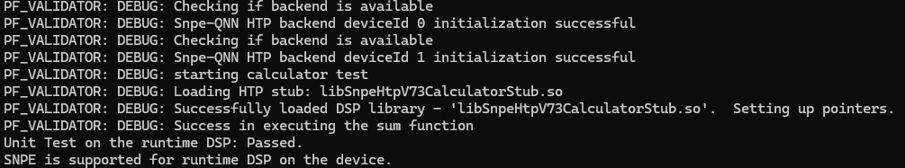
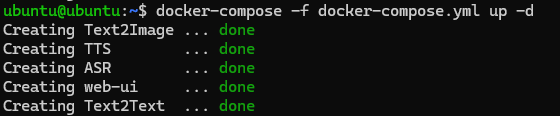
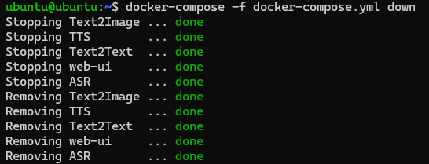

# Introduction
GenAI Studio contains ready to deploy solutions on Qualcomm Dragonwing platform.
## Supported platforms
Qualcomm IQ9 - Ubuntu X05

Qualcomm IQ9 - QLI 1.5

# For Qualcomm Ubuntu
## Qualcomm packages
```
sudo add-apt-repository ppa:ubuntu-qcom-iot/qcom-ppa
```
```
sudo apt update
```
```
sudo apt install -y qcom-fastrpc1 qcom-libdmabufheap-dev qcom-fastrpc-dev qcom-dspservices-headers-dev libqnn1 qnn-tools libsnpe1 snpe-tools qcom-property-vault gstreamer1.0-plugins-qcom-mlmetaparser gstreamer1.0-plugins-qcom-mlvpose
```
### CDI setup

```
curl -L -O https://git.codelinaro.org/clo/le/sdk-tools/-/raw/imsdk-tools.lnx.1.0.r1-rel/qimsdk-ubuntu/generate_cdi_json.sh?ref_type=heads&inline=false
```
```
bash generate_cdi_json.sh
```

```
ls /etc/cdi/docker-run-cdi-hw-acc.json
```
##### Replace "/etc/cdi/docker-run-cdi-hw-acc.json" with [docker-run-cdi-hw-acc.json]("./docker-run-cdi-hw-acc.json") from this folder
```
sudo chown -R ubuntu:ubuntu /opt/
```

### Validate Qualcomm NPU
```
snpe-platform-validator --runtime dsp
```
#### Expected output
SNPE is supported for runtime DSP on the device


## Docker Installation
#### Update package index
```
sudo apt-get update
 ```
#### Install required packages
```
sudo apt-get install -y ca-certificates curl gnupg lsb-release
 ```
#### Add Docker’s official GPG key
```
sudo mkdir -p /etc/apt/keyrings
curl -fsSL https://download.docker.com/linux/ubuntu/gpg | \
    sudo gpg --dearmor -o /etc/apt/keyrings/docker.gpg
 ```
#### Set up the Docker repository
```
echo \
  "deb [arch=$(dpkg --print-architecture) signed-by=/etc/apt/keyrings/docker.gpg] \
  https://download.docker.com/linux/ubuntu $(lsb_release -cs) stable" | \
  sudo tee /etc/apt/sources.list.d/docker.list > /dev/null
 ```
#### Update package index again
```
sudo apt-get update
 ```

#### Install Docker Engine
```
sudo apt-get install -y docker-ce docker-ce-cli containerd.io  docker-compose
```

#### Add your user to the docker group (to run docker without sudo)
```
sudo usermod -aG docker $USER
```
```
newgrp docker
```

### Update /etc/docker/daemon.json
```
mkdir -p /etc/docker/
```
### Copy content to /etc/docker/daemon.json
``` 
{
   "features": {
      "cdi": true
   }
}
```
```
sudo systemctl restart docker
```
## Docker containers
## Steps to install arm64 qemu Docker driver on x86 machine
```
docker run --rm --privileged multiarch/qemu-user-static --reset -p yes
docker buildx rm builder
docker buildx create --name builder --driver docker-container --use
docker buildx inspect --bootstrap
```
## Build container images
#### NOTE: Run below commands with **linux/arm64/v8** to build on x86 machine

#### On Target
```
cd Speech-To-Text
docker  build --progress=plain -t asr .
docker save -o asr asr
```
```
cd Text-Generation
docker  build --progress=plain -t text2text . 
docker save text2image -o text2image
```

```
cd Text-To-Speech
docker  build --progress=plain -t text2speech . 
docker save text2image -o text2speech
```

```
cd web-ui
docker  build --progress=plain -t web-ui . 
docker save text2image -o web-ui
```
#### On x86

```
cd Speech-To-Text
docker  build --progress=plain --platform=linux/arm64/v8 -t asr .
docker save -o asr asr
```

```
cd Text-Generation
docker  build --progress=plain --platform=linux/arm64/v8  -t text2text . 
docker save text2image -o text2image
```

```
cd Text-To-Speech
docker  build --progress=plain --platform=linux/arm64/v8  -t text2speech . 
docker save text2image -o text2speech
```

```
cd web-ui
docker  build --progress=plain --platform=linux/arm64/v8  -t web-ui . 
docker save text2image -o web-ui
```

## Pre-built container images (aarch64)
#### NOTE: Push container images to device following above and run below commands on target aarch64 device
```
docker load -i asr
docker load -i text2text
docker load -i text2speech
docker load -i web-ui
```
## LLM steps (Linux X86)
### Environment Setup
Follow https://github.com/quic/ai-hub-apps/tree/main/tutorials/llm_on_genie
### Model Generation
```
python -m qai_hub_models.models.llama_v3_8b_instruct.export --chipset qualcomm-snapdragon-x-elite --skip-inferencing --skip-profiling --output-dir genie_bundle
```
##### NOTE: Push models folder genie_bundle to "/opt/" on target device
## TTS steps (linux x86)
Follow https://qpm.qualcomm.com/#/main/tools/details/VoiceAI_TTS to generate models
##### NOTE: Push models to "/opt/TTS_models/" on target device


## Start GenAI Studio (Target Device aarch64)
### Push docker-compose.yml file to device
```
docker-compose -f docker-compose.yml up -d
```
#### Expected output


**NOTE:** If you face this error "CDI device injection failed: failed to inject devices: failed to stat CDI host device "/dev/kgsl-3d0": no such file or directory"

**Solution**: Remove "/dev/kgsl-3d0" from /etc/cdi/docker-run-cdi-hw-acc.json
```
{
   "path": "/dev/kgsl-3d0"
},
```

If there are any other errors use "**[docker-run-cdi-hw-acc.json]("./docker-run-cdi-hw-acc.json")**" from this folder

### Network URL
```
docker logs -f web-ui
```
#### Expected output

  You can now view your Streamlit app in your browser.

  Local URL: http://localhost:8501

  Network URL: http://192.168.0.4:8501


#### NOTE
Click on http://192.168.0.4:8501 to open webpage

## Stop  GenAI Studio
```
docker-compose -f docker-compose.yml down
```
#### Expected output



