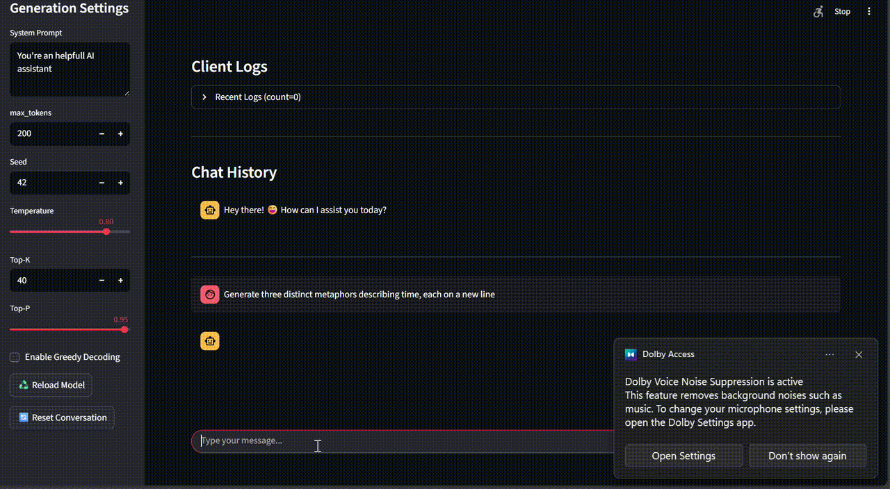
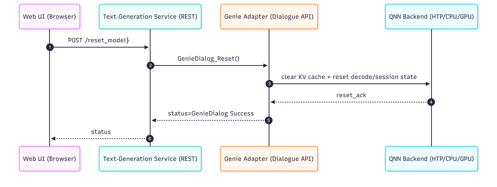

# Text2Text 

# Text-to-Text LLM Server on IQ9 (Qualcomm Ubuntu/Linux)

This project runs a **Text-to-Text Large Language Model (LLM) on IQ9 Qualcomm Ubuntu/Linux** using the Genie API.
It provides a persistent (always-on) LLM server with the following capabilities:

- Generate LLM responses from user prompts (Text-to-Text)
- Reuse a preloaded model to avoid reloading on every request
- Provide control endpoints for model/session reset and model reload
- Allow updating the system prompt directly from the UI
- Support conversation history, enabling the UI to fetch previous messages.

---

## 1) What this does (Text-to-Text)

**Text-to-Text**: Generates human-like responses from a prompt.  
Useful for creating: **articles, summaries, reports, creative content**, etc.

---
### Process (Text Generation) Call Flow

---
### Model Reset Call Flow

---
### Model Reload Call Flow
